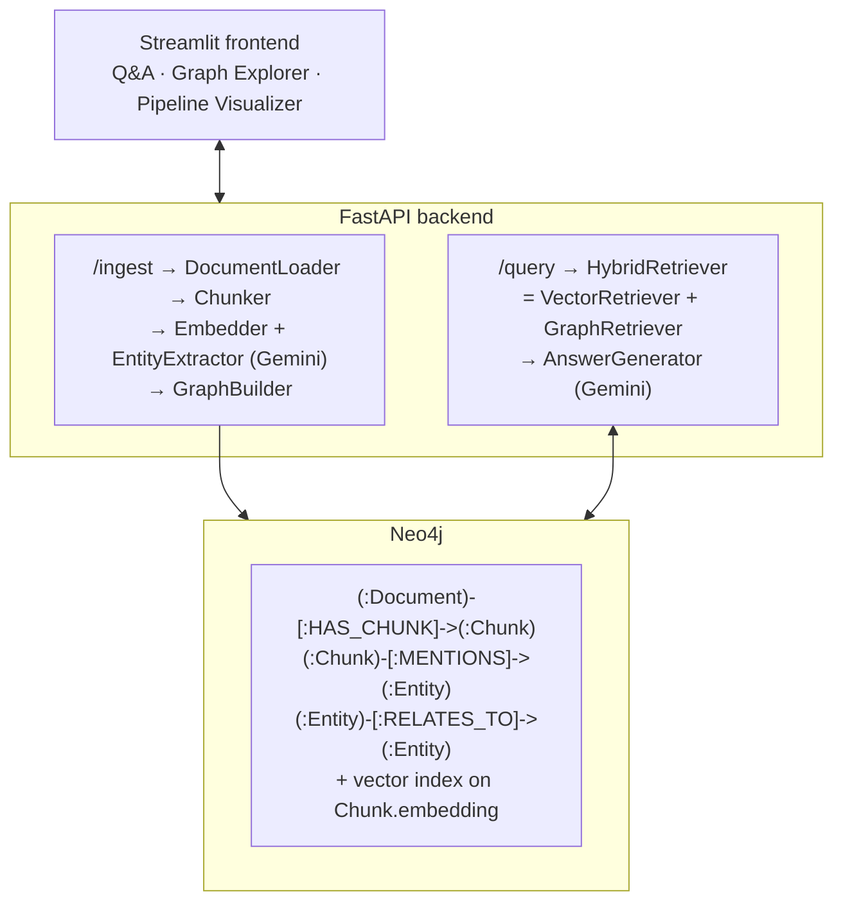

# GraphRAG

[](https://github.com/MinhNTN14/graphrag/actions/workflows/ci.yml)
[](https://www.python.org/downloads/)
[](https://github.com/astral-sh/ruff)
[](LICENSE)

A production-ready **GraphRAG** system that combines a **Neo4j** knowledge graph
with **vector similarity search**, powered by **Google Gemini**. It supports both
document Q&A (RAG) and entity-relationship exploration (Graph), exposed via a
**FastAPI** backend and a **Streamlit** UI.

---

## Architecture



> A visual, screenshot-driven walkthrough of the whole pipeline lives in
> [`docs/MECHANISM.md`](docs/MECHANISM.md).

### Data model

| Node        | Key properties                                   |
|-------------|--------------------------------------------------|
| `:Document` | `id`, `ingested`, `file_name`                    |
| `:Chunk`    | `id`, `text`, `embedding` (768-d), `doc_id`, `chunk_index`, `page_num`, `file_name` |
| `:Entity`   | `name` (unique), `type`, `description`           |

| Relationship               | Meaning                              |
|----------------------------|--------------------------------------|
| `(:Document)-[:HAS_CHUNK]->(:Chunk)` | Document owns a chunk        |
| `(:Chunk)-[:MENTIONS]->(:Entity)`    | Chunk mentions an entity     |
| `(:Entity)-[:RELATES_TO]->(:Entity)` | Extracted relationship (`relation`, `description`) |

Indexes: a **vector index** (`chunk_embedding`, 768 dims, cosine) on
`Chunk.embedding` and a **full-text index** (`entity_search`) on
`Entity.name`/`Entity.description`.

---

## Stack

- Python 3.11
- Neo4j 5.x (`neo4j` driver, APOC plugin)
- Google Gemini (via the `google-genai` SDK) — embeddings (768-d) + generation,
  with **dynamic model selection** (see below): resolves to `gemini-embedding-001`
  + `gemini-flash-latest` on current APIs
- FastAPI + uvicorn
- Streamlit + streamlit-agraph + altair + numpy (visualisations)
- Docker + Docker Compose
- pytest + pytest-asyncio

### Dynamic model selection

Model ids get retired (this app originally targeted `text-embedding-004` +
`gemini-1.5-flash`, both since removed). Rather than hard-code one, at start-up
`app/core/gemini_models.py` lists the account's models once
(`client.models.list()`) and picks the **newest available** model from a
priority list (by each model's `supported_actions`), falling back to older ones — and to a
broadly-available static default if the API can't be listed. So the app keeps
working as Google rotates models. Priority (newest first):

- **Generation:** `gemini-flash-latest → gemini-3.5-flash → … → gemini-2.5-flash`
- **Embedding:** `gemini-embedding-001 → gemini-embedding-2 → text-embedding-004`

Embeddings are always requested at **768 dimensions** to match the vector index.

---

## Quickstart

```bash
cp .env.example .env
# Add your GEMINI_API_KEY to .env
docker-compose up -d
# Wait for Neo4j to be healthy (~30s)

# Ingest a document:
curl -X POST http://localhost:8000/api/v1/ingest \
  -F "file=@your_document.pdf"

# Query:
curl -X POST http://localhost:8000/api/v1/query \
  -H "Content-Type: application/json" \
  -d '{"question": "What is the main topic?", "mode": "hybrid"}'

# Or open the Streamlit UI (run locally against the API):
pip install -r requirements.txt
streamlit run frontend/streamlit_app.py
```

Neo4j Browser is available at <http://localhost:7474> (user `neo4j`, password
from `.env`). The API's interactive docs are at <http://localhost:8000/docs>.

### Running the API locally (without Docker)

```bash
pip install -r requirements.txt
# Point NEO4J_URI at a running Neo4j instance, e.g. bolt://localhost:7687
uvicorn app.main:app --reload
```

### Running the tests

```bash
pip install -r requirements.txt
pytest                       # unit + API tests (Neo4j tests auto-skip)
NEO4J_URI=bolt://localhost:7687 pytest   # also run Neo4j integration tests
```

---

## Retrieval Mode Comparison

- **Vector mode** — embeds the question and finds semantically similar text
  chunks via the Neo4j vector index. *Good for:* "What does the document say
  about X?" Fast, but misses implicit connections that aren't lexically or
  semantically close.

- **Graph mode** — extracts entities from the question, traverses the knowledge
  graph (up to 2 hops via `RELATES_TO`) to find related entities and the chunks
  that mention them. *Good for:* "How is A related to B?" Slower, but captures
  multi-hop reasoning that pure vector search cannot.

- **Hybrid mode** — runs both, deduplicates chunks by `chunk_id`, and merges the
  context. Chunks that appear in **both** paths are flagged `source="both"` as
  high-confidence sources; results are ranked by vector score. Best default for
  most questions.

---

## API Reference

Base path: `/api/v1`

### `POST /api/v1/ingest`

Upload a document (multipart form field `file`; PDF, TXT or MD).

**Request** (multipart): `file=@document.pdf`

**Response**
```json
{
  "doc_id": "a1b2c3d4e5f60718",
  "chunks_processed": 12,
  "entities_created": 34,
  "relationships_created": 20,
  "message": "Successfully ingested 'document.pdf'."
}
```

### `POST /api/v1/ingest/path`

Ingest a document already present on the server's filesystem.

**Request**
```json
{ "file_path": "/data/document.pdf" }
```

**Response** — same shape as `POST /api/v1/ingest`.

### `POST /api/v1/query`

Answer a question over the ingested corpus.

**Request**
```json
{
  "question": "How is Neo4j related to vector search?",
  "mode": "hybrid",
  "top_k": 5
}
```
`mode` is one of `hybrid` (default), `vector`, `graph`. `top_k` ∈ [1, 20].

**Response**
```json
{
  "answer": "Neo4j provides a native vector index ...",
  "sources": [
    {
      "chunk_id": "a1b2c3d4e5f60718_3",
      "text": "Neo4j 5 introduced a native vector index ...",
      "doc_id": "a1b2c3d4e5f60718",
      "score": 0.8123,
      "source": "both"
    }
  ],
  "graph_context": [
    {
      "source": "Neo4j",
      "relation": "SUPPORTS",
      "target": "Vector Search",
      "description": "Neo4j supports vector similarity search."
    }
  ],
  "mode_used": "hybrid",
  "entities_found": ["Neo4j", "Vector Search"]
}
```

### `GET /api/v1/graph/entities`

List entities. Query params: `type` (optional filter), `limit` (default 50).

**Response**
```json
[
  { "name": "Neo4j", "type": "TECHNOLOGY", "description": "A graph database." }
]
```

### `GET /api/v1/graph/entity/{name}/neighbors`

Return the subgraph around an entity. Query param: `depth` (default 2).

**Response**
```json
{
  "entity": { "name": "Neo4j", "type": "TECHNOLOGY", "description": "A graph database." },
  "neighbors": [
    { "name": "Cypher", "type": "TECHNOLOGY", "description": "Query language." }
  ],
  "relationships": [
    { "source": "Neo4j", "relation": "USES", "target": "Cypher", "description": "Neo4j uses Cypher." }
  ]
}
```

### `GET /api/v1/graph/relations`

Return the shortest relationship path between two entities. Query params:
`source`, `target` (both required).

**Response**
```json
[
  { "source": "Neo4j", "relation": "USES", "target": "Cypher", "description": "Neo4j uses Cypher." }
]
```

### `GET /api/v1/graph/documents`

List ingested documents with chunk/entity counts (powers the visualiser's
document picker).

**Response**
```json
[
  { "doc_id": "818e7276f0a53f6d", "file_name": "2309.06180v1.pdf",
    "ingested": true, "chunk_count": 18, "entity_count": 74 }
]
```

### `GET /api/v1/graph/document/{doc_id}`

Return one document's chunks (with their 768-d embeddings and mentioned
entities), the entity list with types, and the `RELATES_TO` edges among them.
Used to draw the ingestion graph and the embedding scatter.

**Response** (abridged)
```json
{
  "chunks": [
    { "chunk_id": "818e7276f0a53f6d_0", "chunk_index": 0, "page_num": 0,
      "text": "Efficient Memory Management …", "embedding": [0.01, -0.03, "…"],
      "entities": ["PagedAttention", "KV Cache"] }
  ],
  "entities": [ { "name": "PagedAttention", "type": "TECHNOLOGY" } ],
  "relationships": [
    { "source": "PagedAttention", "relation": "REDUCES",
      "target": "Internal Fragmentation", "description": "…" }
  ]
}
```

### `POST /api/v1/graph/embed-query`

Embed a question and return its raw vector plus the nearest chunks. Lets the
visualiser drop a query into the same 2-D space as the chunks and show exactly
what vector search retrieves.

**Request**
```json
{ "question": "How does PagedAttention reduce fragmentation?", "top_k": 5 }
```

**Response**
```json
{
  "embedding": [0.02, -0.01, "…768 floats…"],
  "retrieved": [
    { "chunk_id": "818e7276f0a53f6d_5", "doc_id": "818e7276f0a53f6d", "score": 0.9065 }
  ]
}
```

### `GET /health`

```json
{ "status": "ok", "neo4j": true }
```

---

## Configuration

All settings are read from environment variables (see `.env.example`):

| Variable          | Default                 | Description                        |
|-------------------|-------------------------|------------------------------------|
| `GEMINI_API_KEY`  | —                       | Google Gemini API key (required).  |
| `NEO4J_URI`       | `bolt://neo4j:7687`     | Bolt URI of the Neo4j server.      |
| `NEO4J_USERNAME`  | `neo4j`                 | Neo4j user.                        |
| `NEO4J_PASSWORD`  | `password123`           | Neo4j password.                    |
| `NEO4J_DATABASE`  | `neo4j`                 | Target database name.              |
| `CHUNK_SIZE`      | `512`                   | Chunk size in tokens (approx).     |
| `CHUNK_OVERLAP`   | `50`                    | Overlap between chunks in tokens.  |
| `TOP_K_RESULTS`   | `5`                     | Default number of chunks retrieved.|
| `API_HOST`        | `0.0.0.0`               | API bind host.                     |
| `API_PORT`        | `8000`                  | API bind port.                     |
| `LOG_LEVEL`       | `INFO`                  | loguru log level.                  |

---

## Project layout

```
app/
  config.py                     # pydantic-settings configuration
  main.py                       # FastAPI app, lifespan, routers, health
  core/
    gemini_models.py            # dynamic newest-first model selection + fallback
    graph/
      neo4j_client.py           # all Cypher / schema / indexes / viz queries
      graph_builder.py          # chunk -> embed -> extract -> persist
    ingestion/
      document_loader.py        # PDF/TXT/MD loading
      chunker.py                # overlapping token-approx chunking
      embedder.py               # Gemini embeddings (retry)
      entity_extractor.py       # Gemini entity/relationship extraction (retry)
    retrieval/
      vector_retriever.py
      graph_retriever.py
      hybrid_retriever.py
    generation/
      answer_generator.py       # Gemini answer synthesis (retry)
  models/                       # pydantic v2 request/response models
  api/routes/                   # ingest / query / graph routers
frontend/
  streamlit_app.py              # three-tab Streamlit UI (see below)
tests/                          # ingestion / graph / api tests
docs/
  MECHANISM.md                  # deep-dive + interview prep
```

---

## Streamlit UI

`streamlit run frontend/streamlit_app.py` opens a three-tab app:

1. **Document Q&A** — upload a PDF/TXT/MD, ingest it, then chat over it. Each
   answer shows its source chunks (with similarity scores) and any graph
   relationships used.
2. **Knowledge Graph Explorer** — search entities by name/type, expand an
   entity's subgraph to any depth, and find the shortest relationship path
   between two entities. Shows the Cypher behind each view.
3. **Pipeline Visualizer** — makes the RAG pipeline visible for a chosen
   document:
   - **Ingestion graph** — the `Document → Chunk → Entity` network, entities
     coloured by type and every node sized by how connected it is.
   - **Embedding space** — every chunk's 768-d vector projected to 2-D (PCA),
     with faint links to each paragraph's nearest neighbours so semantic
     clusters are visible. This *is* the "vector database" the retriever searches.
   - **Query retrieval** — type a question; it's embedded into the same space
     and the top-k nearest chunks light up with connector lines whose thickness
     is their similarity score — exactly what vector search returns.
