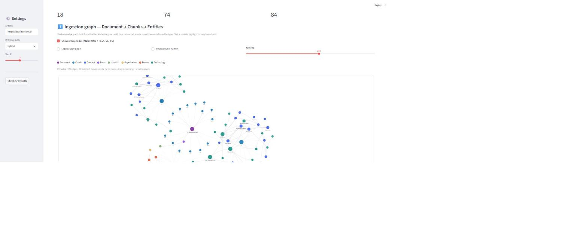
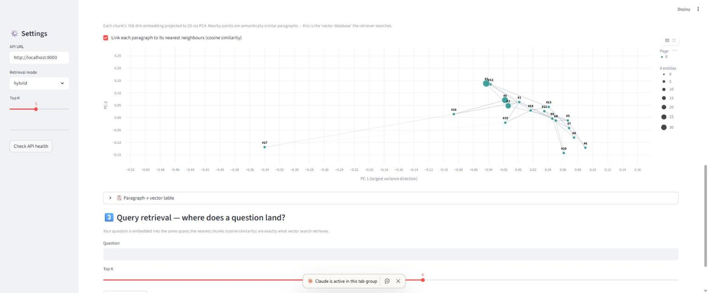
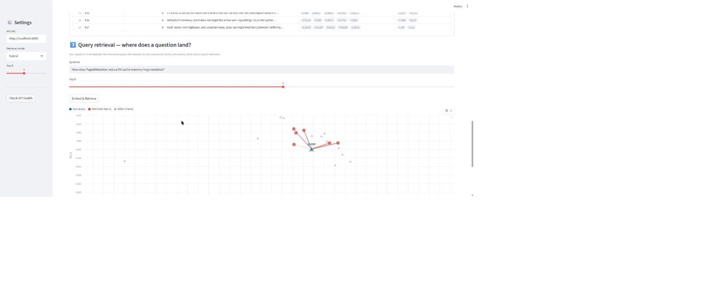
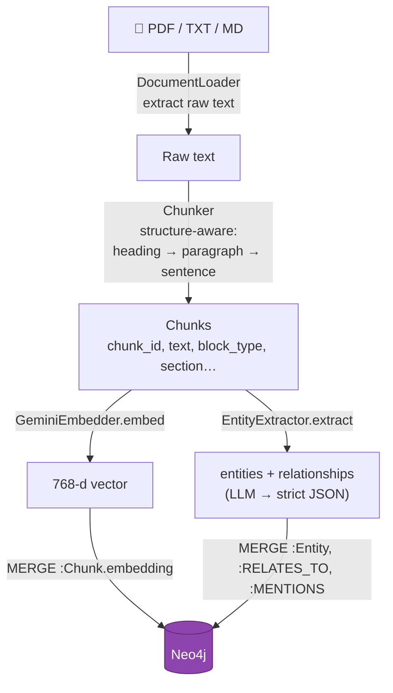
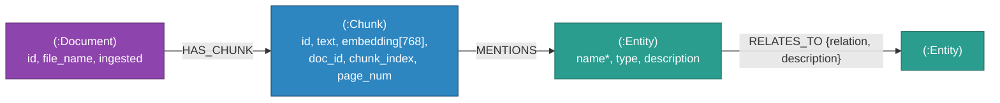
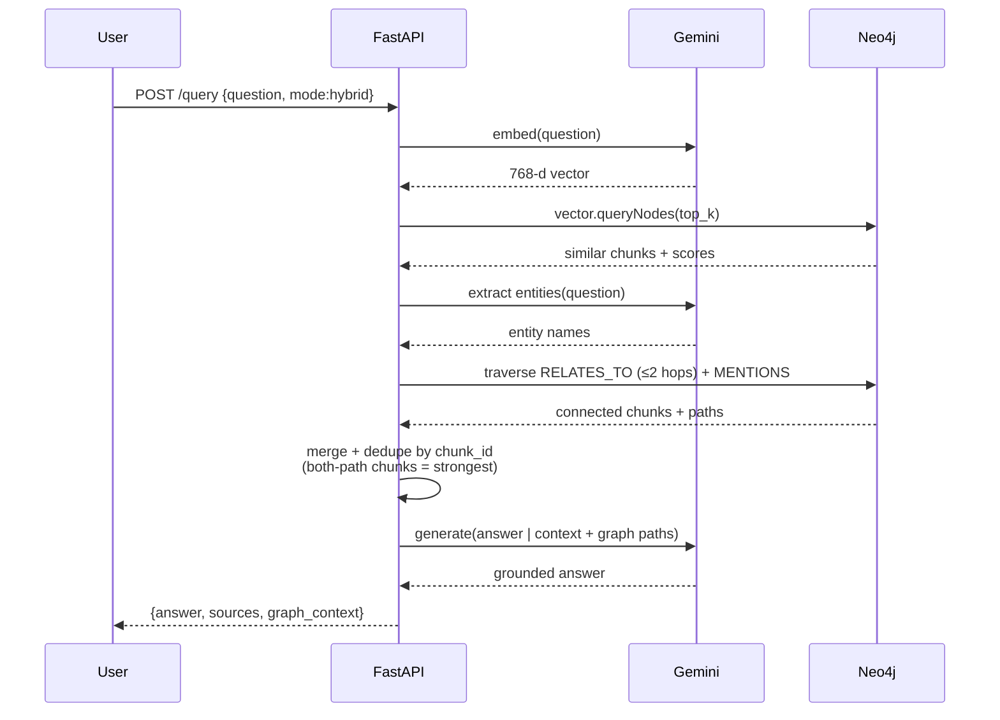

# GraphRAG — How It Works & Interview Prep

A deep-dive into what this system does end-to-end, the design decisions behind
it, and a bank of interview questions with strong answers. Read the first half
to understand the mechanism; use the second half to rehearse.

- [Visual walkthrough](#visual-walkthrough)
- [Part 1 — The mechanism](#part-1--the-mechanism)
- [Part 2 — Design decisions & trade-offs](#part-2--design-decisions--trade-offs)
- [Part 3 — Interview Q&A](#part-3--interview-qa)
- [Part 4 — 60-second whiteboard script](#part-4--60-second-whiteboard-script)
- [Appendix — reference tables](#appendix--reference-tables)

---

## Visual walkthrough

The **Pipeline Visualizer** tab makes each stage of the pipeline concrete. The
screenshots below are the real app running on the vLLM / PagedAttention paper
(`2309.06180v1.pdf` — 18 chunks, 74 entities, 84 relationships).

**① Ingestion graph — `Document → Chunk → Entity`.** The knowledge graph built
from the file. The purple hexagon is the document; blue dots are chunks; the
coloured dots are entities (coloured by type). Node size grows with how
connected a node is, so the document's hub concepts (`PagedAttention`, `vLLM`,
`KV Cache`) stand out. Only hub nodes are labelled to avoid clutter — the rest
reveal their name on hover.



**② Embedding space — each paragraph as a vector.** Every chunk's 768-dim
embedding projected to 2-D with PCA. Point size = number of entities in the
chunk; faint grey links connect each paragraph to its nearest neighbours (cosine
similarity), so semantic clusters are visible. **This is the "vector database"
the retriever searches.**



**③ Query retrieval — where does a question land?** The question is embedded into
the *same* space (teal ▲ `QUERY`). The nearest chunks light up red, connected by
lines whose thickness is the similarity score — exactly what vector search
returns. Grey points are the chunks that were not retrieved.



---

## Part 1 — The mechanism

### 1.0 The one-paragraph summary

This is a **hybrid retrieval-augmented generation** system. When you ingest a
document it is split into overlapping chunks; each chunk is turned into a 768-d
**embedding vector** (stored in a Neo4j vector index) *and* passed to an LLM
that extracts **entities and relationships** into a knowledge graph. At query
time we retrieve context two ways — **vector similarity** (semantically similar
chunks) and **graph traversal** (chunks connected to entities in the question) —
merge them, and feed the combined context to Gemini to generate a grounded,
cited answer.

Why bother with the graph? Pure vector RAG is great at "what does the document
say about X?" but weak at "how are A and B related?" — multi-hop questions where
the answer lives in the *connections* between facts, not in any single passage.
The graph captures those connections explicitly.

### 1.1 The stack, and who does what

| Layer | Component | Responsibility |
|-------|-----------|----------------|
| UI | Streamlit | Upload, chat, graph explorer, pipeline visualizer |
| API | FastAPI | REST endpoints, request validation, singletons |
| Embeddings + LLM | Google Gemini | Turn text → vectors; extract entities; write answers |
| Storage + retrieval | Neo4j 5 | Graph store **and** vector index in one database |

A key architectural point: **Neo4j is doing double duty**. Since v5 it ships a
native vector index, so we don't need a separate vector DB (Pinecone, Weaviate,
etc.). Chunks, entities, *and* their embeddings all live in one graph, which is
what makes true hybrid retrieval cheap — both the vectors and the relationships
are one `MATCH` away from each other.

### 1.2 Ingestion — from a file to a queryable graph

Entry point: `POST /api/v1/ingest` → `GraphBuilder.build_from_file()`.



Step by step:

1. **Load** (`document_loader.py`). PDFs are read page-by-page with `pypdf`;
   TXT/MD are read directly. The `doc_id` is a hash of the content, so
   re-ingesting the same file is idempotent (a dedup check skips it).

2. **Chunk — structure-aware / semantic** (`chunker.py`). Rather than blindly
   slicing a fixed number of words (which cuts through the middle of sentences
   and destroys meaning), the text is parsed into **blocks** — headings,
   paragraphs, **tables, images, code** — and then:
   - **Tables, images and code blocks are kept atomic**: never split, never
     merged with surrounding prose, so a table or figure becomes *its own chunk*
     (tagged `block_type` = `table`/`image`/`code`).
   - **Prose is packed by whole sentences** up to the size budget; a boundary
     always falls *between* sentences. A single run-on sentence longer than the
     budget is hard-split by words only as a last resort.
   - **Overlap is carried at sentence granularity** — whole trailing sentences,
     never a fragment of a word.
   - Each chunk records the **`section`** heading it sits under, which is
     prepended to the text so the embedding and extractor get topic context.

   Each chunk carries `chunk_index`, `page_num`, `file_name`, `block_type` and
   `section`. `chunk_id` is `f"{doc_id}_{chunk_index}"`.

   *Note:* table/image detection is reliable for Markdown/text (pipe tables,
   `` images). Native PDF text extraction (`pypdf`) does not preserve
   tables or figures, so extracting those from PDFs would need a richer parser
   (e.g. `pdfplumber` for tables, `PyMuPDF` for images) — a clean future add.

3. **Embed** (`embedder.py`). Each chunk's text is sent to Gemini's embedding
   model, which returns a **768-dimensional** float vector. That number is not
   arbitrary — it must match the dimension the Neo4j vector index was created
   with. The embedding is the chunk's coordinates in "meaning space": chunks
   about similar topics land near each other.

4. **Extract entities + relationships** (`entity_extractor.py`). The chunk text
   is sent to the generative model with a strict prompt: *return ONLY JSON* with
   `entities` (name, type, description) and `relationships` (source, relation,
   target, description). The response is defensively parsed — code fences
   stripped, first `{...}` block extracted, and **any parse failure returns an
   empty result instead of raising**, so one bad chunk never aborts a whole
   ingest.

5. **Persist** (`neo4j_client.py`). Everything is written with `MERGE` (upsert),
   which makes ingestion **idempotent** and safe to retry:
   - `MERGE (c:Chunk {id})` + set `text, embedding, doc_id, chunk_index, …`
   - `MERGE (d:Document {id})-[:HAS_CHUNK]->(c)`
   - `MERGE (e:Entity {name})` (name is the unique key)
   - `MERGE (a:Entity)-[:RELATES_TO {relation}]->(b:Entity)`
   - `MERGE (c:Chunk)-[:MENTIONS]->(e:Entity)`

The result is a graph where the *vector* layer (Chunk embeddings) and the
*symbolic* layer (Entity relationships) are stitched together by the
`MENTIONS` edge. That edge is the bridge that makes hybrid retrieval possible.

### 1.3 The data model



The **`MENTIONS` edge is the bridge** between the vector layer (chunks) and the
symbolic layer (entities) — it is what lets one query use both signals.

Indexes (created once at start-up, all idempotent):
- **Vector index** `chunk_embedding` on `Chunk.embedding` — 768 dims, **cosine**
  similarity.
- **Full-text index** `entity_search` on `Entity.name` / `Entity.description`.
- **Uniqueness constraints** on `Entity.name`, `Chunk.id`, `Document.id`.

### 1.4 Query — three retrieval modes

Entry point: `POST /api/v1/query` → `HybridRetriever.retrieve()` →
`AnswerGenerator.generate()`.

**Vector mode** — the question is embedded with the *same* model, then:

```cypher
CALL db.index.vector.queryNodes('chunk_embedding', $top_k, $embedding)
YIELD node, score
RETURN node.id, node.text, node.doc_id, score ORDER BY score DESC
```

This returns the `top_k` chunks whose embeddings are closest to the question's
embedding (cosine). Great for "what does the doc say about X". Blind to
connections that aren't semantically close in wording.

**Graph mode** — entities are extracted *from the question* (same extractor),
then we traverse the graph:

```cypher
MATCH (seed:Entity) WHERE seed.name IN $names
MATCH (seed)-[:RELATES_TO*0..2]-(reached:Entity)
MATCH (c:Chunk)-[:MENTIONS]->(reached)
RETURN DISTINCT c.id, c.text, c.doc_id
```

So from the entities in your question we walk up to 2 hops through the
relationship graph and collect every chunk mentioning any entity we reach. This
is what answers multi-hop questions ("how is A connected to B?"): the path
between A and B is data in the graph, not something the LLM has to already know.

**Hybrid mode (default)** — run both, **deduplicate chunks by `chunk_id`**, and
merge. A chunk found by *both* paths is flagged `source="both"` — a strong
signal it's relevant (semantically similar *and* structurally connected).
Results are ordered by vector score. The graph paths themselves are also passed
to the LLM as an explicit "here are the known relationships" section.

**Generation** (`answer_generator.py`). The merged chunks become a numbered
context block; the graph paths become a relationships block; both go into a
prompt that instructs the model to *answer only from the provided context, say
so if it's insufficient, and cite the chunk/document*. This grounding is what
keeps the answer faithful and reduces hallucination.

Hybrid mode end-to-end:



**Retrieval modes at a glance:**

| Mode | How it retrieves | Best for | Weakness |
|------|------------------|----------|----------|
| **Vector** | Embed question → nearest chunks by cosine | "What does the doc say about X?" | Misses links not close in wording |
| **Graph** | Entities in question → walk ≤2 `RELATES_TO` hops → chunks that mention reached entities | "How is A related to B?" multi-hop | Needs entities to exist in the graph; slower |
| **Hybrid** *(default)* | Both, deduped by `chunk_id`; `source="both"` = strongest | Most questions | Two passes → higher latency/cost |

### 1.5 The pipeline visualizer (how to *see* all of the above)

The third Streamlit tab makes the abstract pipeline concrete for any ingested
document:

- **Ingestion graph** — draws `Document → Chunk → Entity`. Entities are coloured
  by type; nodes are sized by degree, so the document's hub concepts pop out.
- **Embedding space** — projects every chunk's 768-d vector to 2-D with **PCA**
  (numpy SVD) and draws faint links between each chunk and its nearest
  neighbours (cosine). You can literally see semantic clusters — this *is* the
  vector DB.
- **Query retrieval** — embeds your question, projects it into the *same* 2-D
  space using the chunks' PCA basis (`(q − mean) @ componentsᵀ`), and lights up
  the retrieved chunks with connector lines whose thickness = similarity. It's
  the clearest possible answer to "which paragraph does my query turn into a
  vector near, and which chunks does it pull back?"

### 1.6 Dynamic model selection (resilience detail)

Model ids get retired — this project originally used `text-embedding-004` and
`gemini-1.5-flash`, both since removed by Google, which broke it. The fix
(`gemini_models.py`): at start-up, call `list_models()` once, and pick the
**newest available** model from a priority list, falling back to older ones, and
to a broadly-available static default if listing fails. Result cached per
process. Embeddings are always requested at 768 dims to match the index. So the
app self-heals as models rotate instead of hard-failing.

---

## Part 2 — Design decisions & trade-offs

| Decision | Why | Trade-off / cost |
|----------|-----|------------------|
| Neo4j for **both** graph and vectors | One store, one query surface; the `MENTIONS` edge joins vectors to structure for free | Not as specialised as a dedicated vector DB at huge scale (billions of vectors) |
| Hybrid retrieval by default | Vector alone misses multi-hop; graph alone misses fuzzy semantic matches | Two retrieval passes + entity extraction on the query = higher latency/cost per query |
| LLM-based entity extraction | Flexible, no schema/NER model to train, works on any domain | Non-deterministic, costs an LLM call per chunk, quality depends on the prompt |
| `MERGE` everywhere | Idempotent ingest; safe to retry after a rate-limit failure | Slightly slower than raw `CREATE`; needs the uniqueness constraints |
| Cosine similarity | Standard for text embeddings; length-invariant | — |
| Character-window chunking | Simple, dependency-free, predictable | Not semantically aware; a smarter splitter (by heading/sentence) would improve chunk quality |
| Defensive JSON parsing, empty-on-failure | One malformed LLM response can't abort a 100-chunk ingest | A silently-dropped chunk yields no entities (still embedded & retrievable) |
| Tenacity exponential backoff | Free-tier Gemini is rate-limited (~RPM caps); backoff rides through 429s | Long ingests can be slow when throttled |
| Dynamic model selection | Google retires model ids; hard-coding breaks the app | One extra `list_models()` call at start-up |

---

## Part 3 — Interview Q&A

### Conceptual

**Q: What is GraphRAG and how is it different from "normal" RAG?**
Normal RAG = embed the query, pull the top-k semantically similar chunks, stuff
them in the prompt. GraphRAG adds a **knowledge-graph layer**: during ingestion
an LLM extracts entities and relationships into a graph, and at query time we
*also* retrieve by traversing that graph. The payoff is **multi-hop reasoning** —
questions whose answer depends on how facts connect, not on any single passage.
We combine both signals (hybrid retrieval).

**Q: Give a concrete example where plain vector RAG fails but the graph helps.**
"Which technique that reduces KV-cache fragmentation is used by the system built
by the vLLM authors?" No single chunk likely states that full chain. Vector
search returns passages about fragmentation and passages about the authors, but
the *link* — author → system → technique → fragmentation — is a path in the
graph. Graph traversal walks that path and pulls the connecting chunks.

**Q: Why store embeddings in Neo4j instead of a dedicated vector DB?**
Because the whole value proposition is *joining* semantic similarity with graph
structure. If vectors live in Pinecone and the graph in Neo4j, every hybrid
query is a cross-system join you have to orchestrate yourself. Keeping both in
Neo4j means a chunk's vector and its `MENTIONS`/`RELATES_TO` edges are one
`MATCH` apart. The trade-off is that a specialised vector DB scales to far larger
vector counts — at billions of vectors I'd reconsider.

### Retrieval

**Q: Walk me through what happens on a query in hybrid mode.**
(1) Embed the question with the same embedding model. (2) Vector search:
`db.index.vector.queryNodes` returns top-k chunks by cosine. (3) Extract
entities from the question; graph search matches those entities, traverses up to
2 `RELATES_TO` hops, and collects chunks that `MENTIONS` any reached entity.
(4) Merge and dedupe chunks by id; chunks found by both paths are marked
`source="both"`. (5) Build a context block + a relationships block and prompt
Gemini to answer only from that context, with citations.

**Q: How do you dedupe and rank across the two sources?**
Dedupe by `chunk_id` (a chunk retrieved twice is kept once). Ranking is by
vector similarity score; graph-only chunks have no score but are retained for
their structural relevance, and "both" is treated as the strongest signal.

**Q: Why cosine similarity and not Euclidean?**
Text embeddings encode direction/semantics more than magnitude; cosine is
length-invariant so it compares *meaning* rather than vector size, and it's the
convention these embedding models are trained/evaluated against.

**Q: What is `top_k` and how would you tune it?**
The number of chunks pulled per query. Too low → you miss relevant context; too
high → you dilute the prompt with noise and pay more tokens. Tune empirically
against a question set; it interacts with chunk size (bigger chunks → fewer
needed).

### Ingestion & embeddings

**Q: Why chunk at all, and why the overlap?**
Documents exceed the model's useful context and embed poorly as one blob —
you'd get one averaged vector with no locality. Chunking gives fine-grained,
independently-retrievable units. Overlap prevents losing a fact that sits on a
chunk boundary, since it appears in both neighbours.

**Q: What determines the 768 number?**
It's the embedding dimensionality, and it must equal the dimension the Neo4j
vector index was created with. Mismatch → the index rejects the vector. We
request 768 explicitly so the model doesn't return a different default.

**Q: How do you extract entities, and what if the LLM returns junk?**
A strict prompt asks for JSON-only with a fixed schema. Parsing is defensive:
strip markdown fences, grab the first `{...}`, `json.loads`. On *any* failure we
return an empty `{entities: [], relationships: []}` and log a warning — the chunk
is still embedded and retrievable, so a single bad extraction doesn't corrupt or
abort the ingest.

**Q: Is ingestion idempotent? What happens if it fails halfway?**
Yes — everything is `MERGE` (upsert) keyed on unique ids/names, and there's a
document-level dedup check. If an ingest dies halfway (e.g. a rate-limit), you
re-run it: already-written chunks/entities merge no-ops, and it continues. No
duplicates, no corruption.

### Architecture & production

**Q: How are the clients (Neo4j, Gemini) managed in the API?**
As singletons created in the FastAPI **lifespan** and stored on `app.state`, so
the driver connection pool and configured model are reused across requests
rather than rebuilt per call. Routes pull them off `request.app.state`.

**Q: How do you handle Gemini rate limits?**
Free tier caps requests-per-minute, so every model call is wrapped in
**tenacity** exponential backoff (retry with growing waits, capped attempts). We
also reduce call volume with larger chunks. In production I'd add a token-bucket
limiter, batch where the API allows, and cache embeddings for unchanged text.

**Q: The app broke once because a model id was retired. How did you make it
robust?** I added dynamic model selection: at start-up we `list_models()` and
pick the newest available from a priority list, with fallbacks and a static
default. The app now self-heals across Google's model rotations instead of
hard-failing on a 404.

**Q: How would you scale this to millions of documents?**
Vector search stays sub-linear via the index (HNSW-style). The pressure points
are (1) ingestion throughput — parallelise embedding/extraction with a queue and
workers; (2) LLM cost — batch and cache; (3) graph size — periodically merge
duplicate/near-duplicate entities (entity resolution) or the graph gets noisy;
(4) at extreme vector counts, consider a dedicated ANN store and keep Neo4j for
structure. I'd also add evaluation (retrieval precision/recall, answer
faithfulness) before scaling blindly.

**Q: How do you prevent hallucination?**
Grounding: the prompt explicitly says answer *only* from the provided context,
admit when it's insufficient, and cite the chunk/doc. Retrieval quality is the
real lever — good chunks in, faithful answer out. Returning sources lets a user
verify every claim.

### Curveballs

**Q: What are the weakest parts of this system?**
(1) No entity resolution, so "GPT-4" and "GPT 4" can become two nodes. (2) Entity
extraction is non-deterministic and costs an LLM call per chunk. (3) No relevance
evaluation harness yet. (4) Free-tier rate limits make big ingests slow. (5)
Table/image separation works on Markdown but not on native-PDF text (`pypdf`
gives plain text) — a richer PDF parser would close that gap. Each is a concrete,
ownable improvement.

**Q: How does the chunker preserve meaning?**
It's **structure-aware**: text is parsed into heading / paragraph / table /
image / code blocks. Tables, images and code are kept **atomic** (each becomes
its own chunk), and prose is packed by **whole sentences** so a chunk never ends
mid-sentence; overlap is carried as whole trailing sentences. Each chunk also
records its **section heading**, prepended for topic context. This beats blind
fixed-width windows, which slice through sentences and merge unrelated content.

**Q: The graph retrieval fixes hop-count at 2. Why, and when is that wrong?**
2 hops balances recall against blowup — traversal fans out exponentially, and
beyond 2–3 hops you pull in loosely-related noise. For deep causal-chain
questions you'd want more hops but with a relevance filter (e.g. weight by
relationship confidence) so you don't drown the prompt.

**Q: If two chunks are near-duplicates, does that hurt retrieval?**
Yes — they'd both rank high and waste top-k slots on redundant context. Mitigate
with de-duplication / MMR (maximal marginal relevance) to diversify results, or
dedupe at ingest.

---

## Part 4 — 60-second whiteboard script

> "It's hybrid RAG over a knowledge graph. **Ingest:** load → chunk with overlap
> → each chunk gets a 768-d embedding *and* goes to an LLM that pulls out
> entities and relationships. All of it lands in Neo4j — chunks with their
> vectors, entities, and the edges between them — joined by a `MENTIONS` edge.
>
> **Query:** I retrieve two ways. Vector search finds semantically similar
> chunks via Neo4j's vector index. Graph search takes the entities in the
> question, walks a couple of hops through the relationship graph, and grabs the
> chunks along those paths. I merge and dedupe, chunks hit by both are the
> strongest signal, and feed everything to the LLM with instructions to answer
> only from that context and cite it.
>
> **Why the graph?** Plain vector RAG can't do multi-hop — 'how is A related to
> B' — because the answer is in the *connections*, not one passage. The graph
> stores those connections explicitly. And it's all in one database, so the
> vectors and the structure are one query away from each other."

Draw while you talk:

```
file → [chunk] → embed ─► ●vector ─┐
                └─► LLM ─► entities ├─► Neo4j (graph + vector index)
                          + rels ───┘
question → embed ─► vector search ─┐
        └► entities → graph walk ──┴─► merge/dedupe → LLM → grounded, cited answer
```

---

## Appendix — reference tables

### Entity types

The extractor classifies every entity into one of these types; the visualizer
colours nodes by them.

| Type | Meaning | Example (vLLM paper) |
|------|---------|----------------------|
| `PERSON` | A named individual | Woosuk Kwon, Ying Sheng |
| `ORGANIZATION` | Company, lab, university | UC Berkeley |
| `TECHNOLOGY` | System, algorithm, tool | PagedAttention, KV Cache, vLLM |
| `CONCEPT` | An abstract idea or metric | Internal Fragmentation, Throughput |
| `LOCATION` | A place | — |
| `EVENT` | A time-bound happening | — |

### Key configuration knobs

| Variable | Default | What it changes | Tune when… |
|----------|---------|-----------------|------------|
| `CHUNK_SIZE` | 1200 | Chars per chunk | Bigger → fewer LLM calls (dodges rate limits), coarser retrieval |
| `CHUNK_OVERLAP` | 120 | Chars shared between neighbours | Raise if answers get cut at boundaries |
| `TOP_K_RESULTS` | 5 | Chunks retrieved per query | Raise for recall, lower to cut prompt noise/cost |
| embedding dim | 768 | Vector size (must match index) | Fixed — changing needs a new vector index |
| graph hops | 2 | `RELATES_TO` traversal depth | Raise for deep multi-hop, but filter for relevance |

### Cost / latency per stage (Gemini free tier)

| Stage | External calls | Dominant cost | Notes |
|-------|----------------|---------------|-------|
| Ingest — embed | 1 embed / chunk | Rate limit (RPM) | Batched by looping; retried with backoff |
| Ingest — extract | 1 generate / chunk | Rate limit (RPM) | The main throttle on large docs |
| Query — vector | 1 embed + 1 Cypher | Embed latency | Sub-linear via the vector index |
| Query — graph | 1 extract + Cypher | Extract latency | Only in `graph`/`hybrid` modes |
| Query — answer | 1 generate | Generation latency | Skipped if no context retrieved |

### Troubleshooting (issues actually hit building this)

| Symptom | Root cause | Fix |
|---------|-----------|-----|
| `AuthError` on Neo4j | Aura username **and** database are the instance id, not `neo4j` | Set `NEO4J_USERNAME`/`NEO4J_DATABASE` to the instance id |
| `404 model not found` | Model id retired (`text-embedding-004`, `gemini-1.5-flash`) | Dynamic model selection picks the newest available at start-up |
| `429 ResourceExhausted` | Free-tier RPM/daily cap during ingest | Bigger chunks + exponential backoff; switch to a model with separate quota |
| Ingest curl times out | Rate-limit backoffs make it slow | `MERGE` is idempotent — re-run to resume; no duplicates |
| Port 8000 won't bind | Old `python.exe` still holding it (Windows) | `Get-NetTCPConnection -LocalPort 8000` → `Stop-Process -Force` |
| Graph viz blank / labels overlap | streamlit-agraph vis.js aborts on custom physics; 90+ labels in a small box | Render vis.js directly via `components.html`; label only hub nodes; `avoidOverlap` physics |

### Glossary

| Term | One-line definition |
|------|---------------------|
| **RAG** | Retrieval-Augmented Generation — fetch relevant text, then let the LLM answer from it |
| **GraphRAG** | RAG that also retrieves by traversing a knowledge graph, enabling multi-hop reasoning |
| **Embedding** | A vector that encodes a text's meaning; nearby vectors = similar meaning |
| **Vector index** | A structure (HNSW-style) for fast nearest-neighbour search over embeddings |
| **Cosine similarity** | Similarity by angle between vectors; length-invariant, standard for text |
| **Chunk** | A small, independently-retrievable slice of a document |
| **Entity / relationship** | Nodes and typed edges the LLM extracts into the knowledge graph |
| **`MENTIONS`** | Edge linking a chunk to an entity it names — the bridge between vectors and graph |
| **Hybrid retrieval** | Combining vector similarity and graph traversal, then merging results |
| **PCA** | Projection that flattens 768-d vectors to 2-D for the embedding-space plot |
| **MMR** | Maximal Marginal Relevance — re-ranking that diversifies results to cut redundancy |
